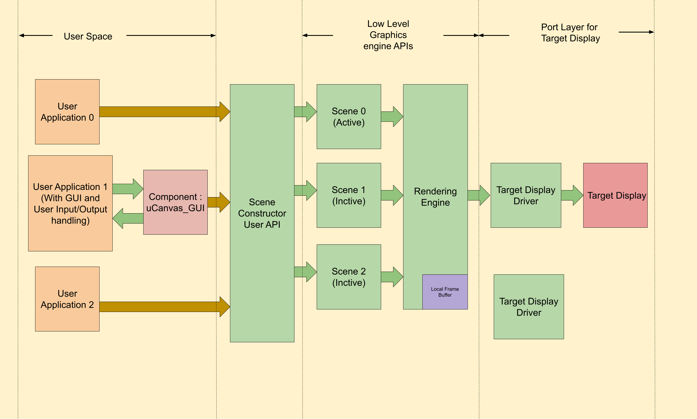

## uCanvas 2D Graphics API

### Overview
Microcanvas is 2D Retained mode graphics engine that let's you build portable 2D Video Games and GUI Applications. 


As you create new 2D elements on screen, Microcanvas library creates model of scene. user can manipulate each object on screen directly through changing properties of 2D objects without explicitly need to clear, draw and updating the screen. 

here is example how microcanvas lets user update elements on display, 
```
uCanvas_universal_obj_t* box = New_uCanvas_2DRectangle(x_poistion,y_position,height,width);
box->properties.fill = NOFILL;   //Don't fill the
box->properties.position.x += 10; //move box by 10 units to right.
```