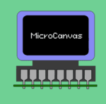

## MicroCanvas 2D Graphics Library For MicroController



### Overview
* Microcanvas is 2D Retained mode graphics engine that let's you build portable 2D Video Games and GUI Applications. 
* Microcanvas treats everything as an universal object that can become anything during the runtime.
* What it means that you can morph any universal object into rectangle, circle, textbox, sprite or any other built in premitives. MicroCanvas Only needs you to define object with initial type (i.e rectangle) feed properties data like dimensions,position,color,visibility etc.
* As you create new 2D elements on screen, Microcanvas library creates model of scene. A user can manipulate each object on screen directly through changing properties of 2D objects without explicitly need to clear, draw and updating the screen. 

## Getting Started With MicroCanvas

### Setup MicroCanvas 
```c
/* MicroCanvas Setup Example */
start_uCanvas_engine();  //Initializes Display Driver and uCanvas Renderer,
uCanvas_Scene_t* scene = New_uCanvas_Scene(); //Create Scene Object to store scene model
uCanvas_set_active_scene(scene); //Indicates which Scene Instance uCanvas Renderer should use to draw display. 
    
```
### Create Universal Object Instance As A Rectangle

```c
uCanvas_universal_obj_t* box = New_uCanvas_2DRectangle(x_poistion,y_position,height,width);
box->properties.fill = NOFILL;   //Don't fill the
box->properties.position.x += 10; //move box by 10 units to right.
```


