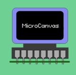
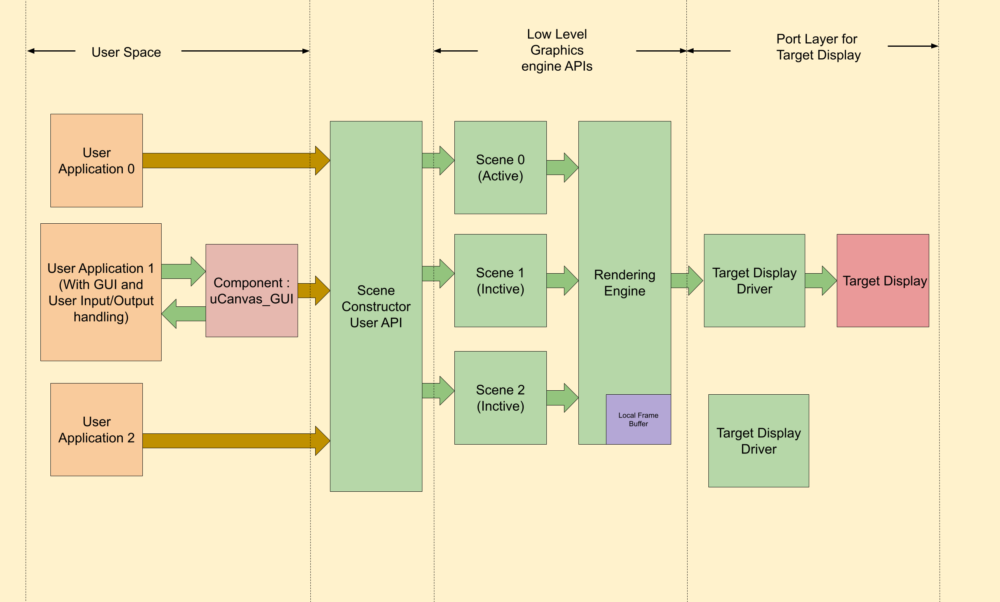

## MicroCanvas 2D Graphics Library For MicroController



### Overview
* Microcanvas is 2D Retained mode graphics engine that let's you build portable 2D Video Games and GUI Applications. 
* Microcanvas treats everything as an universal object that can become anything during the runtime.
* What it means that you can morph any universal object into rectangle, circle, textbox, sprite or any other built in premitives. MicroCanvas Only needs you to define object with initial type (i.e rectangle) feed properties data like dimensions,position,color,visibility etc.
* As you create new 2D elements on screen, Microcanvas library creates model of scene. A user can manipulate each object on screen directly through changing properties of 2D objects without explicitly need to clear, draw and updating the screen. 

## Getting Started With MicroCanvas

### Setup MicroCanvas 
In order to kicstart the Microcanvas in your application you need to perform only 3 steps : 
1. Start ucanvas Instance by setting panel, render buffer, 
2. Define Scene Object to hold universal object
3. Set Defiend Scene an Active to add objects using uCanvas API such as New_uCanvas_2DRectangle etc.
4. 
```c
/* MicroCanvas Setup Example */
static uCanvas2D_Instance_t uCanvas_Instance_1;
Intialize_PPA();
/**
 * Scene Object Basically Stores all Universal Objects Created by 
 * Application while it is set as an Active scene.
 */
uCanvas_Scene_t* scene1 = New_uCanvas_Scene(); 
uCanvas_Scene_t* scene2 = New_uCanvas_Scene(); 

// Create Panel Object
uCanvas2D_Display_Panel_t* panel = uCanvas2D_Get_Panel_Driver_EK79007();
panel->init(1);
panel->set_backlight(3000);

//Set Up uCanvas Instance
uCanvas_Attach_RenderBuffer(&uCanvas_Instance_1,CANVAS_WIDTH,CANVAS_HEIGHT); //Attach a framebuffer to instance
uCanvas_Attach_Panel(&uCanvas_Instance_1,panel); //Attach initialized display panel object
uCanvas_Set_ViewPort_Position(&uCanvas_Instance_1,0,0); //Set Position of Instance on Display.
uCanvas_Attach_Scene(&uCanvas_Instance_1,scene1); // Set Scene to render through instance
uCanvas_Attach_Renderer(&uCanvas_Instance_1,1); // Attach Renderer task to instance
uCanvas_Set_Panel_RefreshDelay(&uCanvas_Instance_1,5);//Set Refresh delay

/** This API sets Passed Scene Object as an active scene which is used
 * by renderer and uCanvas_Api.c to update display content. For simple applications
 * you mostly work with single scene instance. when you need to update content of display
 * quickly and need to go back and forth frequently it makes sense to use Multiple Scene Instances.
*/
uCanvas_set_active_scene(scene1); //Sets Scene1 as Active. 
uCanvas_set_active_scene(scene2); //Sets Scene2 as Active. 
    
```

### Working with Universal Object Instance
1. `New_uCanvas_2DRectangle` API Initializes universal object as a rectangle.
2. Once Object initialized you can set Other properties like fill, visiblity, color, position etc throughout your application just like example shown below. 
3. As you change various properties of universal object, The change is reflected on display instantly without any need to send command to renderer from your application code.  

```c
uCanvas_universal_obj_t* box = New_uCanvas_2DRectangle(x_poistion,y_position,height,width);
box->properties.fill = NOFILL;   //Don't fill the
box->properties.position.x += 10; //move box by 10 units to right.
```





